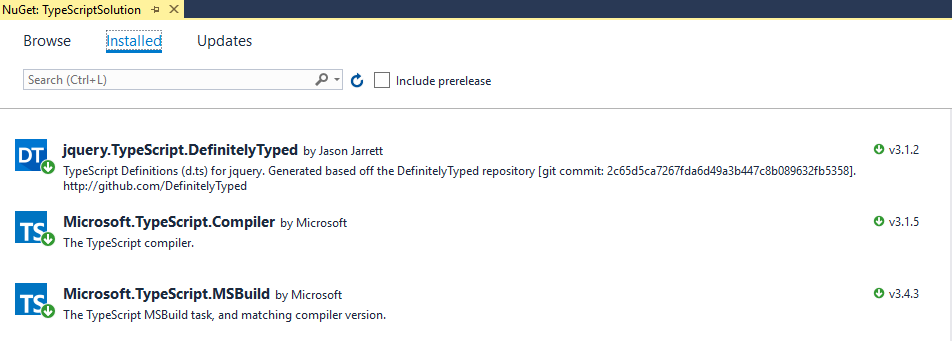
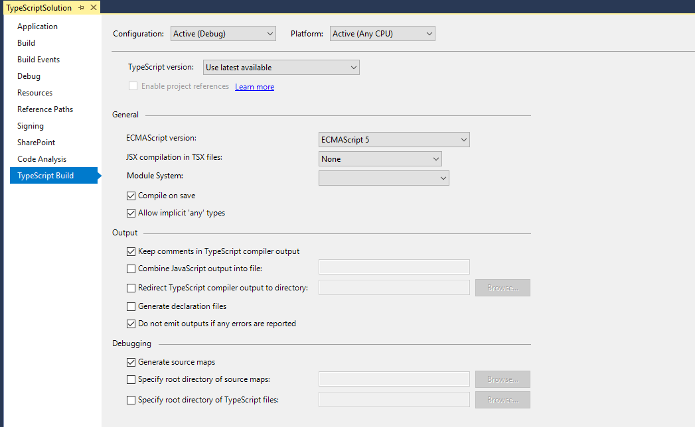

# Server Side Solutions (WSP) & TypeScript

[Typescript Documentation](https://www.typescriptlang.org/docs/home.html)

## Add TypeScript Related NuGetPackages



## Enable Sourcemap Deploy

- Unload project
- Add this to the end of \*.csproj

```
<Target Name="AddTsToContent" AfterTargets="CompileTypeScript" Condition="'$(BuildingProject)' != 'false'">
  <ItemGroup>
      <Content Include="@(TypeScriptCompile)" Condition="'$(Configuration)'=='Debug'" />
  </ItemGroup>
</Target>
```

- Reload project to see TypeScript Build Tab


