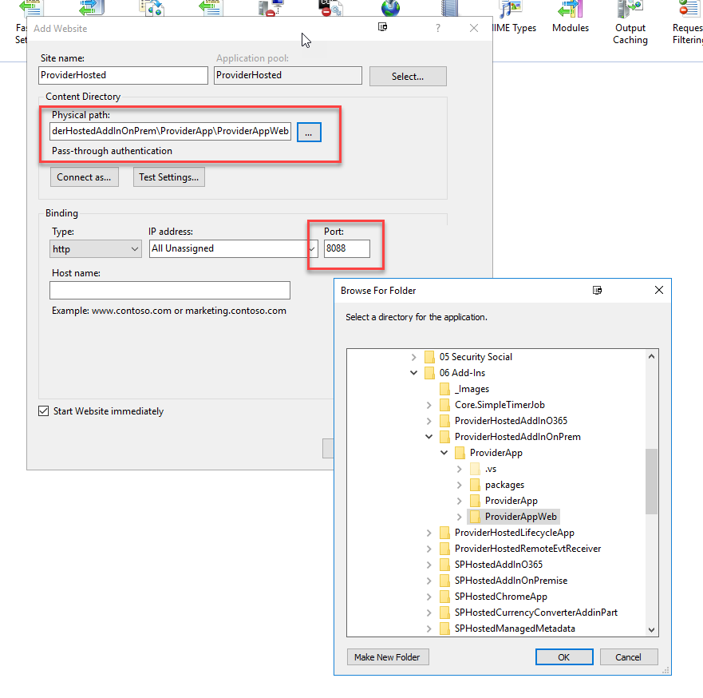
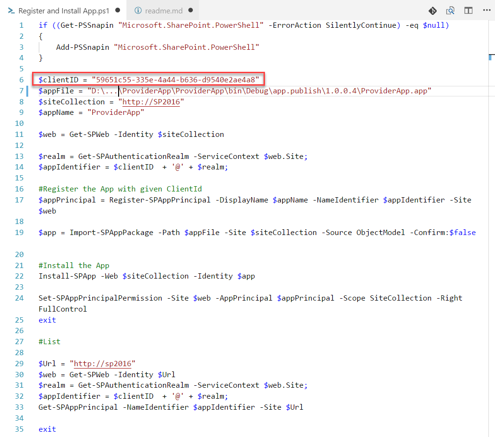

# Extending SharePoint

[Configure Sharepoint for Add-Ins](https://docs.microsoft.com/en-us/sharepoint/dev/sp-add-ins/set-up-an-on-premises-development-environment-for-sharepoint-add-ins)

[URLs and Tokens in Add-Ins](https://docs.microsoft.com/en-us/sharepoint/dev/sp-add-ins/url-strings-and-tokens-in-sharepoint-add-ins)

## Provider Hosted Add-Ins

### Deploy High Trust Provider Hosted Add-In

#### Publish Add-In

#### Deploy Provider Hosted App Web

#### Execute Script - DeployProviderHosted.ps1

