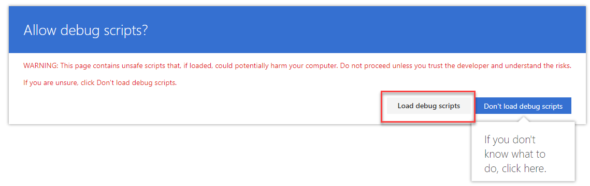

# SPFx Extensions

[Overview of SharePoint Framework Extensions](https://docs.microsoft.com/en-us/sharepoint/dev/spfx/extensions/overview-extensions)

Test a specific extension:

```
gulp serve --config=placehoderSample
```
Take config from `serve.json` and adjust pageUrl:  `"https://tenant.sharepoint.com/sites/siteurl/SitePages/Home.aspx"`,

```
"toasterCustomizer": {
    "pageUrl": "https://integrationsonline.sharepoint.com/sites/DevGrp/SitePages/Home.aspx",
    "customActions": {
        "5736a293-7aa2-467f-9ffd-7da201da4d5e": {
            "location": "ClientSideExtension.ApplicationCustomizer",
            "properties": {
                "testMessage": "Test message"
            }
        }
    }
    },
"placehoderSample": {
    "pageUrl": "https://integrationsonline.sharepoint.com/sites/DevGrp/SitePages/Home.aspx",
    "customActions": {
        "e1176819-fff6-4f05-9f43-505633d23b41": {
            "location": "ClientSideExtension.ApplicationCustomizer",
            "properties": {
                "testMessage": "Test message"
            }
        }
    }
},
```
Choose "Load debug scripts"



> For Toaster Sample create Powershell to creat the list and insert at least one item to the list

# Further Material

[SharePoint Framework Extensions Samples & Tutorial Materials](https://github.com/SharePoint/sp-dev-fx-extensions)